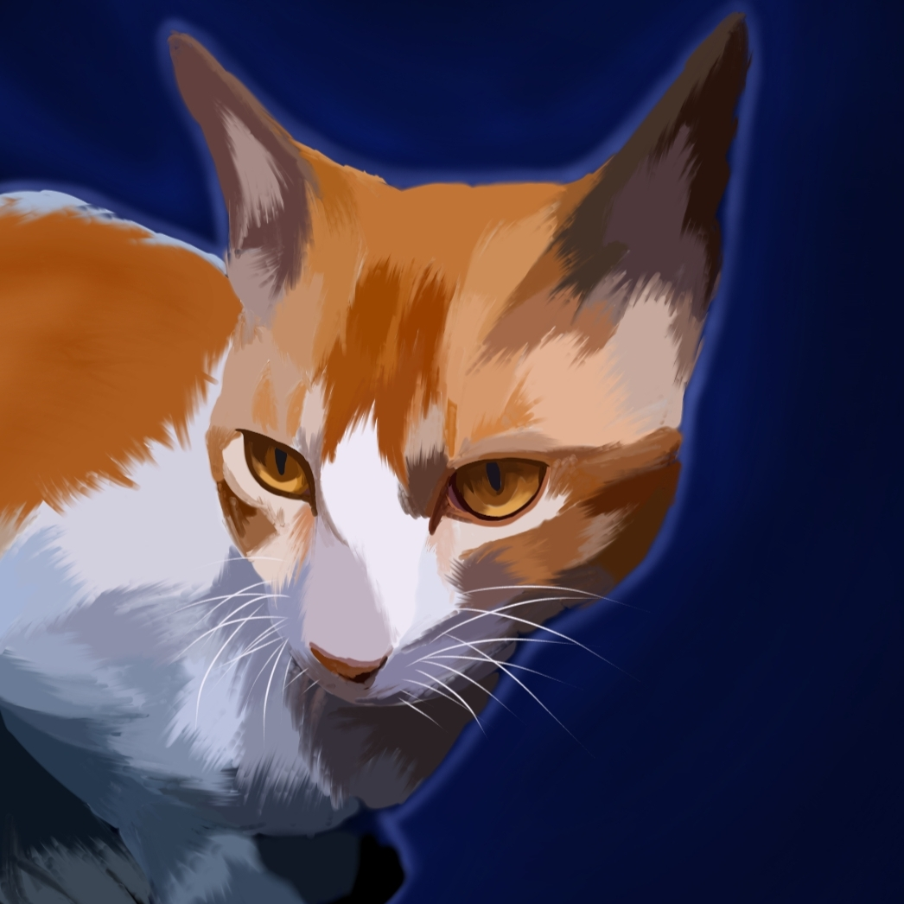

<div align="center">
  
  <h1>🤖 Inevitable Bot</h1>
  <p>A multi-purpose Discord bot built with Python, featuring advanced logging, moderation, and slash commands.</p>

  [](https://dsc.gg/inevitablebot)
  [](https://inevitable-r80k.onrender.com)
  [](https://discord.gg/F9N8DmsJyz)
  [](https://top.gg/bot/920757063599132683/vote)
</div>

---

## 🌟 Features

* **Advanced Server Logging**: Automatically logs crucial server events:
  * 📥 Member joins and leaves (with account age tracking)
  * ✏️ Member nickname updates
  * 🗑️ Message deletions
  * 📝 Message edits (with before and after content)
  * 🎙️ Voice channel updates (join, leave, and switch)
* **🛡️ Moderation**: Keep your community safe with powerful tools like purge, kick, ban, and timeout.
* **🎵 Music**: High-quality music playback directly in your voice channels. Queue, skip, pause, and play your favorite tracks.
* **🎲 Games & Fun**: Keep your members engaged with interactive games like Hot Potato, dice rolling, and fun social commands.
* **Slash Commands**: Fully utilizes Discord's modern `/` commands interface for better user experience.
* **Always Online**: Hosted on [Render](https://render.com) and monitored via [UptimeRobot](https://uptimerobot.com) to ensure maximum uptime.
* **Database Integration**: Seamlessly connected to MongoDB to store server configurations like log channel IDs.

## 🛠️ Built With

* **Language**: [Python](https://www.python.org/)
* **Library**: [discord.py](https://discordpy.readthedocs.io/)
* **Database**: [MongoDB](https://www.mongodb.com/)
* **Hosting**: [Render](https://render.com) (Monitored by UptimeRobot)

## 🔗 Links

* **[Invite Inevitable Bot](https://dsc.gg/inevitablebot)** to your server!
* **[Join the Support Server](https://discord.gg/F9N8DmsJyz)** for help or suggestions.
* **[Vote for the Bot](https://top.gg/bot/920757063599132683/vote)** on Top.gg.
* **[Bot Website](https://inevitable-r80k.onrender.com)**
* **[Terms of Service](https://inevitable-r80k.onrender.com/tos)** | **[Privacy Policy](https://inevitable-r80k.onrender.com/privacy)**

## 🚀 Setup (Self-Hosting)

If you'd like to self-host this bot, follow these steps:

1. Clone the repository:
   ```bash
   git clone https://github.com/your-username/inevitable.git
   ```
2. Install the required dependencies:
   ```bash
   pip install -r requirements.txt
   ```
3. Create a `.env` file in the root directory and add your credentials:
   ```env
   BOT_TOKEN=your_discord_bot_token
   # Add your MongoDB connection string if required by db.py
   ```
4. Run the bot:
   ```bash
   python main.py
   ```

---

## 👨‍💻 Developer

Built with ❤️ by **Unbeatable** (Discord: `3alif`).
If you find this project helpful, consider giving it a ⭐ on GitHub!
